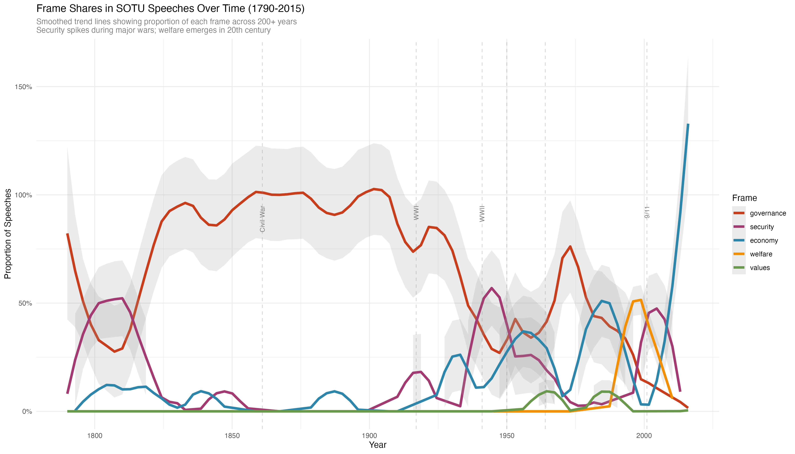
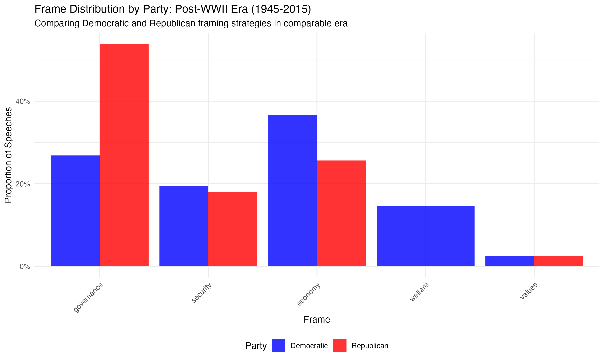
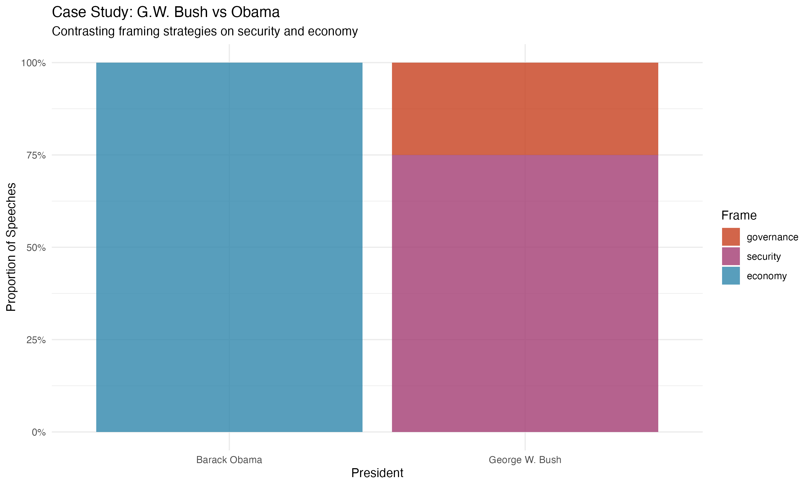

```{r setup, include=FALSE}
knitr::opts_chunk$set(echo = FALSE, warning = FALSE, message = FALSE,
                      fig.width = 10, fig.height = 6, dpi = 300)
library(tidyverse)
library(quanteda)
```

## Slide 1: Research Question and Importance {.smaller}

### Research Questions

1.  How do U.S. presidents frame **economy, security, welfare,
    governance, and values** in SOTU speeches?

2.  How does framing differ by **party** (Democrat vs Republican)?

3.  How has framing changed **over time** (1790-2015)?

### Why This Matters

-   **Framing theory**: Shapes public perception and policy priorities
-   **Agenda-setting**: SOTU speeches set the national agenda
-   **Historical perspective**: 200+ years reveal long-term patterns
-   **Party differences**: Understanding communication strategies

**Key Insight**: Presidents don't just report facts—they **frame**
issues to emphasize certain aspects.

------------------------------------------------------------------------

## Slide 2: Data {.smaller}

### Dataset

-   **236 SOTU speeches** (1790-2015)
-   **Variables**: president, year, party, text
-   **Coverage**: Washington to Obama

### Preprocessing

-   Tokenization, stopword removal, feature trimming
-   **Final**: 236 documents × 6,687 features

### Frame Categories

-   **Economy**: growth, jobs, taxes, trade
-   **Security**: defense, war, terrorism, foreign policy
-   **Welfare**: healthcare, education, social programs
-   **Governance**: budget, deficit, government performance
-   **Values**: democracy, rights, freedom, faith

### Validation

-   20 hand-coded speeches from PS2
-   Used to validate automated assignment

------------------------------------------------------------------------

## Slide 3: Approach {.smaller}

### Methodology: Dictionary-Based Frame Assignment

**Step 1**: Define 5 frame categories + keyword dictionaries (105
keywords)

**Step 2**: Dictionary lookup → assign frame with highest keyword count

**Step 3**: Validate against 20 hand-coded speeches - **Accuracy:
42.1%** (baseline for dictionary method)

### Analysis Strategy

1.  **Overview**: Full period (1790-2015) - long-term patterns
2.  **Focused Era**: Post-WWII (1945-2015) - comparable analysis\
3.  **Case Studies**: Key presidents (LBJ vs Reagan, Bush vs Obama)

### Why Dictionary-Based?

-   Transparent and interpretable
-   Fast and scalable
-   Good baseline for supervised learning

------------------------------------------------------------------------

## Slide 4: Results {.smaller}

### 1. Temporal Patterns (1790-2015)

```{r overview-plot, out.width="100%"}
# Load and display overview plot

```

**Key Finding**: Security frames spike during major wars; welfare frames
emerge in 20th century.

------------------------------------------------------------------------

## Slide 4 (continued): Party Differences {.smaller}

### 2. Party Differences (1945-2015)

```{r party-plot, out.width="100%"}

```

**Key Finding**: - **Republicans**: Governance 78.9% - **Democrats**:
More diverse (Economy 20.7%, Welfare 6.5%)

------------------------------------------------------------------------

## Slide 4 (continued): Case Studies {.smaller}

### 3. Individual Presidential Styles

```{r case-study, out.width="100%"}

```

**Key Finding**: - **G.W. Bush**: Security frames (post-9/11) -
**Obama**: Economy frames (post-2008 crisis) - **LBJ**: Welfare frames
(Great Society) - **Reagan**: Economy and values

------------------------------------------------------------------------

## Slide 5: Limitations and Next Steps {.smaller}

### Limitations

1.  **Dictionary accuracy**: 42.1% (room for improvement)
2.  **Small validation sample**: Only 20 hand-coded speeches
3.  **Speech-level analysis**: Single frame per speech (many mix frames)
4.  **Historical bias**: Dictionary may favor modern terminology

### Next Steps

1.  **Expand hand-coding**: 50-100 additional speeches
2.  **Supervised classification**: Train classifier on hand-coded data
3.  **Multi-label approach**: Allow multiple frames per speech
4.  **Paragraph-level analysis**: Finer granularity
5.  **Refine dictionary**: Update keywords based on validation

### Conclusion

Clear patterns in presidential framing over 200+ years: - Systematic
differences by party - Individual styles matter - Historical context
shapes framing

**Thank you!**
